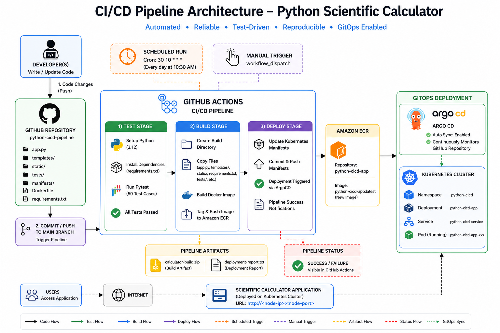

<div align="center">

# 🚀 Python CI/CD Pipeline      

   




</div>

---

# 📂 Project Structure

| File                  | Description                       |
| --------------------- | --------------------------------- |
| 📄 calculator.py      | Scientific Calculator Application |
| 📄 test_calculator.py | Automated Pytest Test Cases       |
| 📄 requirements.txt   | Python Dependencies               |
| 📄 python-ci-cd.yml   | GitHub Actions Workflow           |

---

# 🧠 Project Overview

This project demonstrates a complete Continuous Integration and Continuous Deployment (CI/CD) workflow using GitHub Actions.

The application is a Python-based Scientific Calculator containing multiple mathematical operations and a comprehensive automated testing suite.

The CI/CD pipeline automatically validates code quality, executes tests, generates build artifacts, and performs deployment simulation whenever code changes are pushed to GitHub.

---

# 🏗️ Architecture at a Glance

```text
Developer
    │
    ▼
GitHub Repository
    │
    ▼
GitHub Actions Pipeline
    │
    ├── Setup Python 3.12
    ├── Install Dependencies
    ├── Execute Pytest
    ├── Validate Results
    ├── Create Build Package
    ├── Upload Artifact
    ├── Simulated Deployment
    ├── Generate Deployment Report
    └── Upload Deployment Report
            │
            ▼
      Pipeline Status
```

---

# 🔧 Tech Stack

| Layer               | Tool             | Purpose                      |
| ------------------- | ---------------- | ---------------------------- |
| Programming         | Python 3.12      | Application Development      |
| Testing             | Pytest           | Automated Testing            |
| Source Control      | GitHub           | Version Control              |
| CI/CD               | GitHub Actions   | Pipeline Automation          |
| Artifact Management | GitHub Artifacts | Build Storage                |
| Scheduling          | Cron Jobs        | Automated Pipeline Execution |

---

# 🧮 Scientific Calculator Features

The calculator supports the following operations:

### Basic Operations

* Addition
* Subtraction
* Multiplication
* Division

### Scientific Operations

* Power
* Square Root
* Factorial
* Modulus
* Percentage

### Mathematical Functions

* Absolute Value
* Average
* Maximum
* Minimum

### Trigonometric Functions

* Sine
* Cosine
* Tangent

### Logarithmic Functions

* Logarithm

---

# ✅ Automated Testing

The project includes 50 automated test cases covering:

| Operation      | Test Cases |
| -------------- | ---------- |
| Addition       | 5          |
| Subtraction    | 5          |
| Multiplication | 5          |
| Division       | 5          |
| Power          | 5          |
| Square Root    | 5          |
| Factorial      | 5          |
| Modulus        | 5          |
| Absolute Value | 5          |
| Percentage     | 5          |

### Total Coverage

```text
50 Automated Test Cases
```

The pipeline automatically executes all test cases using Pytest before moving to the build stage.

---

# ⚙️ CI/CD Pipeline Breakdown

## 1️⃣ Trigger Stage

Pipeline execution begins when:

* Code is pushed to the main branch
* Scheduled workflow executes automatically
* Manual workflow trigger is initiated

```yaml
on:
  push:
    branches:
      - main

  schedule:
    - cron: '30 10 * * *'

  workflow_dispatch:
```

---

## 2️⃣ Test Stage

### Activities

* Checkout repository
* Setup Python 3.12
* Install dependencies
* Execute Pytest

```bash
pytest -v
```

### Result

Pipeline stops immediately if any test case fails.

---

## 3️⃣ Build Stage

After successful testing:

```bash
mkdir build
cp calculator.py build/
cp requirements.txt build/
cp test_calculator.py build/
zip -r calculator-build.zip build
```

### Generated Artifact

```text
calculator-build.zip
```

The build package contains all files required for deployment.

---

## 4️⃣ Deployment Stage

The deployment phase simulates a production deployment workflow.

### Deployment Activities

* Deploy build artifact
* Generate deployment report
* Upload deployment report

### Generated Report

```text
deployment-report.txt
```

---

# ⏰ Scheduled Automation

The pipeline is configured to execute automatically every day.

### Schedule

```yaml
cron: '30 10 * * *'
```

### Indian Standard Time

```text
4:00 PM IST Daily
```

This demonstrates automated pipeline execution without manual intervention.

---

# 📦 Build Artifacts

The pipeline generates two artifacts:

| Artifact              | Purpose                   |
| --------------------- | ------------------------- |
| calculator-build.zip  | Application Build Package |
| deployment-report.txt | Deployment Summary Report |

Artifacts can be downloaded directly from GitHub Actions workflow runs.

---

# 🚀 How to Run Locally

## Clone Repository

```bash
git clone https://github.com/NIHAL2175/python-cicd-pipeline.git
cd python-cicd-pipeline
```

## Install Dependencies

```bash
pip install -r requirements.txt
```

## Execute Tests

```bash
pytest -v
```

---

# 🔄 Complete Workflow

```text
Developer Push
       │
       ▼
GitHub Repository
       │
       ▼
GitHub Actions
       │
       ▼
Test Stage
       │
       ▼
Build Stage
       │
       ▼
Artifact Upload
       │
       ▼
Deploy Stage
       │
       ▼
Deployment Report
       │
       ▼
Pipeline Success
```

---

# 🎯 Key Learning Outcomes

✅ Continuous Integration

✅ Continuous Deployment Concepts

✅ Automated Testing with Pytest

✅ GitHub Actions Workflow Creation

✅ Build Artifact Management

✅ Scheduled Pipeline Execution

✅ Deployment Automation

✅ Software Delivery Best Practices

---

<div align="center">

# 👨‍💻 Author

### NIHAL N   

DevOps • Cloud

⭐ If you found this project useful, consider giving it a star.

</div>

---